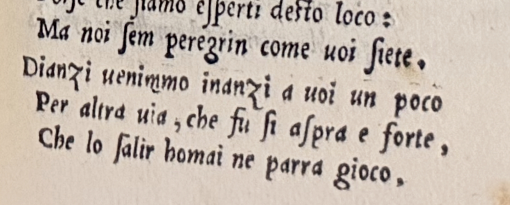
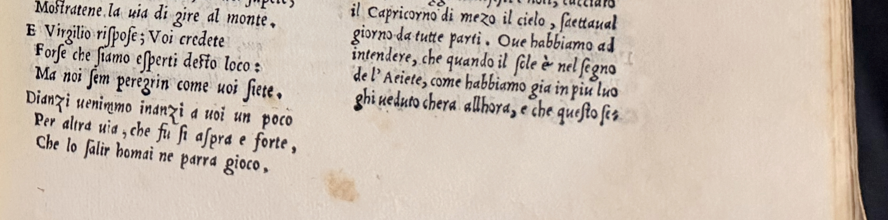
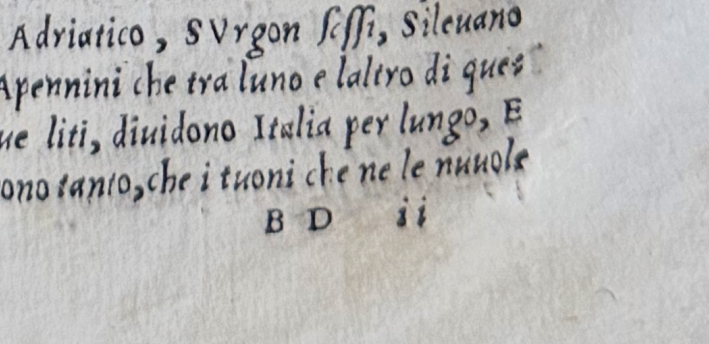
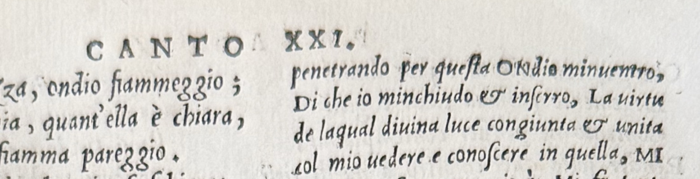
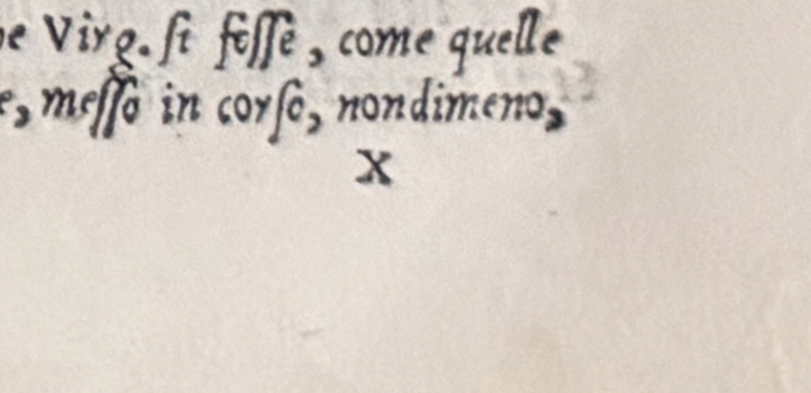

# Collation checklist — Dante, *Comedia*, Venice 1544 (Vellutello)

For determining which issue/state a physical copy is, and what it can be
compared against.

> **Status — 5 September 2026: this copy is Variant B.** The *Purgatorio*
> II.64-66 tercet is present at the foot of the verse column on V7 recto. The
> leaf is confirmed by the signature `X` two leaves later, not by counting. See
> [Result on this copy](#result-on-this-copy--variant-b-) and
> [Photographs of this copy](#photographs-of-this-copy). Check 2 is now closed
> as well — BD2 is signed `BD ii`, the ordinary state. Checks 5 and 6 are still
> open.

Everything under "What the catalogues say" is quoted from WorldCat records in
the Anna's Archive worldcat release (scraped 2022–2023, released 2025-08-04),
reachable in this database as `rpt.item` / `aac.record` where
`collection = 'worldcat'`. Anything I inferred rather than read is marked
**[inference]**. Observations of the physical copy are dated and carry a
reference to the photograph they rest on; statements attributed to Turnovsky or
Tanaka come from correspondence of 2-3 September 2026.

---

## The edition

| | |
| --- | --- |
| Title | *La comedia di Dante Aligieri con la noua espositione di Alessandro Vellutello* |
| Imprint | Venice: Francesco Marcolini, *ad instantia di* Alessandro Vellutello |
| Date | June 1544 |
| Format | 4to, 24 cm |
| Extent | 442 leaves = 884 unnumbered pages |
| Signatures | `2A-2B⁸  2C¹⁰  A-Z⁸  AB-AZ⁸  BC-BI⁸` — final leaf (BI8) blank |
| Illustrations | 87 woodcuts: 3 full-page + 84 smaller |
| Colophon | "Impressa in Vinegia per Francesco Marcolini ad instantia di Alessandro Vellutello del mese di Gugno lanno MDXLIIII" |

Vellutello's commentary was never reprinted in this format, so there is no
second edition of *this* setting to confuse it with. Later Vellutello
reprintings (1564, 1578, 1596) pair his commentary with Landino's and are
plainly different books.

---

## Check 1 — the state test: leaf V7 recto ★

**This is the one that matters.** Everything else confirms you have the right
edition; this tells you which issue.

Find gathering **V**, leaf **7**, **recto**. Look at *Purgatorio* II, lines
**64–66**, at the foot of the text block.

### Finding the leaf

The book has no page numbers. Navigate by signature marks — and note that the
signing alphabet has **23 letters, not 26**: no J, no U, no W, with V doing
duty for U (which is why the title page reads `VELLVTELLO`). So `A-Z⁸` is 23
gatherings and **V is the 20th gathering of the text**, not the 22nd. Reading
it as a modern alphabet puts you two gatherings — 16 leaves — off target.

The arithmetic closes exactly on the recorded 442 leaves, which confirms the
reading:

| Sequence | Quires | Leaves | Running |
| --- | --- | --- | --- |
| `2A-2B⁸ 2C¹⁰` (preliminaries) | 3 | 26 | 26 |
| `A-Z⁸` | 23 | 184 | 210 |
| `AB-AZ⁸` | 22 | 176 | 386 |
| `BC-BI⁸` | 7 | 56 | **442** |

**V1 = leaf 179. V7 = leaf 185 of 442**, about 42% of the way in (page 369 of
884, if you were counting pages).

To find it:

1. **Ignore the 26 preliminary leaves.** Start from the leaf signed **A**, the
   first leaf of the poem proper.
2. **Find the leaf signed `V`** at the foot of the recto — leaf 179 overall,
   or text leaf 153 counting from A.
3. **Count forward 6 leaves.** The 7th is V7.

Step 3 is not optional: **leaf 7 carries no signature mark.** The printer signs
only the first half of each gathering, so you will see `V`, `V ii`, `V iii`,
`V iiii`, perhaps `V v`, then nothing. There is no leaf printed "V vii" to
find. **Recto** is the front of the leaf — the right-hand page with the book
open.

**Signatures are lower-case roman numerals**, set at the foot of the recto —
`V ii`, not `V2`. Confirmed on this copy. The first leaf of a gathering carries
the bare letter with no numeral: the leaf opening gathering X is signed simply
`X`, set below the right-hand column and right of centre rather than hard
against the fore-edge ([photograph](images/X1r-signature.jpg)). Note that the gathering
**after V is X**, not W — the 23-letter alphabet again.

**Faster: use the running headers.** The running title is split across the
opening: the **verso reads `PVRGATORIO`** and the **recto reads the canto** —
`CANTO PRIMO`, `CANTO SECONDO` — and it appears on every page, not just canto
openings. So the quickest route is to open anywhere in Purgatorio, turn until
the recto header reads **`CANTO SECONDO`**, and read down the verse column.
Both halves are confirmed on this copy: see [the V6v-V7r opening](images/V6v-V7r.jpg).

**The spelled-out ordinal is a *Purgatorio* habit, not a rule of the book.** In
*Paradiso* the recto header switches to roman numerals — `CANTO XXI.`, with a
full stop ([photograph](images/BD2r-header.jpg)). That matters for Check 2, not
for this check, but do not carry `CANTO SECONDO` as a template into the back of
the volume.

> **[corrected 4 Sep 2026]** An earlier draft of this file said the headers do
> not name the canticle, and told you to confirm the canticle some other way.
> They do name it — on the verso.

**Observed on this copy** (22 Aug 2026): leaf **V ii recto** carries the header
`CANTO PRIMO` and *Purgatorio* I.58-69, with **12 lines of verse** on that page,
the rest being commentary. From there, 67 lines finish Canto I and 66 more reach
*Purg.* II.66 — 133 lines, about 11 pages, or 5 to 6 leaves. That lands on V7,
and the signature count agrees.

**Do not navigate by a lines-per-page average.** The verse count per page runs
from 12 to 30, because a page may carry **two** separate verse/commentary bands
rather than one. V6 verso holds *Purg.* II.25-36 and II.37-54 as two blocks — 30
verse lines — while V7 recto holds 12. Multiplying an average will put you a
leaf or two out. Count signatures instead, or jump straight to the leaf in the
Manchester scan using the formula under "Copies to compare against".

Two ways to go wrong: a second `V` appears later in the doubled series (`AV`,
around leaf 330) — yours is the **single letter**. And if the signatures are
trimmed off or too faint, fall back on counting: 153 leaves after the leaf
signed A.

**Confirming the page.** The passage is the end of Virgil's reply to the
newly-landed souls who ask the way up the mountain — in modern texts *"Dianzi
venimmo, innanzi a voi un poco, / per altra via, che fu sì aspra e forte, / che
lo salire omai ne parrà gioco."* Spelling will differ in a 1544 text, so read
for sense; the surrounding Vellutello commentary should be discussing that
exchange.

### What the leaf tells you

| What you see | State |
| --- | --- |
| The three lines are **absent** | **Variant A** — the original issue, as first printed |
| The three lines are **present and hand-stamped** in the lower margin | **Variant B** — the corrected issue |
| The three lines are present, level with the block and in matching ink | Re-examine — see "Result on this copy" below; a genuinely integral setting would be unrecorded |

**Use the rhyme, not the line count.** Terza rima interlocks, so a dropped
tercet breaks the chain in a way you can see without counting. Line 62 ends
*loco*, which should be answered by *poco* (64) and *gioco* (66); line 65 ends
*forte*, answered by *accorte* (67) and *smorte* (69). If the tercet is
missing, *"ma noi siam peregrin come uoi siete"* runs straight into *"L'anime,
che si fuor di me accorte"*, and **`loco` and `accorte` are left with nothing
to rhyme against.**

In this book's orthography the tercet should read approximately:

> Dianzi uenimmo, innanzi a uoi un poco,
> Per altra uia, che fu si aspra e forte,
> Che lo salire homai ne parra gioco.

What the catalogues say:

> "Variant A: three lines in Purgatorio II, 64-66 (leaf V7 recto) have been
> omitted. Variant B: the missing lines in Purgatorio II, 64-66 (leaf V7 recto)
> have been added by hand-printing" — OCLC 1019666222

> "This was first issued without the lines Purgatorio II, 64-66 (leaf V7 recto)
> which are hand-stamped in the lower margin in some copies. Cf. Cornell
> University. Libraries. *Catalog of the Dante collection*, no. 1544"
> — OCLC 1184545076

**On the line numbers — 64–66 is the correct reading.** Two other records
(OCLC 558987917 and 841625291) describe the same variant as *"Purgatorio ii,
62-64"*. The poem is in terza rima, so lines group in threes: 61–63, 64–66,
67–69. **64–66 is a complete tercet; 62–64 straddles two.** A three-line
omission at press is a compositor dropping one tercet — a unit of the copy —
not three lines spanning a break. So the 62–64 records are miscounting, and
what you are looking for is **one whole tercet**, missing or stamped in — an
easier thing to spot than three arbitrary lines. **[inference]** The tercet
argument is mine; no record states it.

### Result on this copy — Variant B ★

**Observed 4 Sep 2026.** V7 recto carries the tercet. Its verse column runs
*Purg.* II.55-66 — twelve lines — and 64-66 are the last three:

> Dianzi uenimmo inanzi a uoi un poco,
> Per altra uia, che fu si aspra e forte,
> Che lo salir homai ne parra gioco.



*Lines 62-66 on V7 recto. The added tercet is the last three lines. Note the
wider leading above `Dianzi` and the baselines out of register with the printed
lines above.* — [`V7r-tercet-detail.jpg`](images/V7r-tercet-detail.jpg)



*The same lines against the right-hand commentary column, which stops level with
`Dianzi`. Lines 65-66 hang below the bottom boundary of the original text
block.* — [`V7r-tercet-in-block.jpg`](images/V7r-tercet-in-block.jpg)

Also: [the whole leaf](images/V7r.jpg), and [the full verse column, *Purg.*
II.55-66](images/V7r-verse-column.jpg).

**Why this is the stamped state, not the third row of the table above.** The
decisive argument is bibliographical rather than visual: in this edition the
tercet was never part of the original forme — Variant A copies lack it
altogether — so its presence *is* the addition. Three physical signs
corroborate:

- the tercet hangs **below** the point where the adjacent commentary column
  stops, that is, below the bottom boundary of the original text block;
- the leading above `Dianzi` is wider than the leading between the printed
  lines above it;
- its baselines sit out of register with the lines above.

Treat those three as corroboration and not proof. The photographs were taken at
an angle over a curved page, which can imitate a sloping baseline on its own.

**Registration varies from copy to copy.** Here the stamp keeps the normal terza
rima indentation and merely sits low. In the Manchester copy Turnovsky describes
the addition as displaced on **both** the bottom and left-side margins. That is
what a sheet-by-sheet hand operation produces, and it means a *well*-registered
addition is still Variant B — do not require a sloppy one.

**The mechanism is a second pass through the press, not a stop-press
correction.** Geoffrey Turnovsky (UW Textual Studies, corr. 3 Sep 2026): the
sheets were printed, and the already-printed sheets were then run through the
press a second time with newly set type. That is why the added lines carry
visibly different ink and sit outside the boundaries of the original text block.
It is *not* the standard stop-press pattern, where the type is unlocked and
altered mid-run — with a stop-press correction it is obvious why only some
sheets carry the change, whereas here it is not. Why the second pass was not
applied to every sheet is unknown.

Both variants remain the same edition and the same setting of type — 442 leaves,
same colophon. Variant A is simply the state before the second pass.
**Condition is a separate axis from state:** a worn Variant A is
bibliographically earlier than a pristine Variant B.

> **[corrected 4 Sep 2026]** An earlier draft called this "an in-press
> correction, not a separate printing." That was wrong on both halves.

---

## Check 2 — signature BD2 / AD2 ★

In gathering **BD**, leaf **2**: read the signature mark at the foot.

| What you see | Meaning |
| --- | --- |
| `BD ii` | the ordinary state |
| `AD ii` | the mis-signed variant |

> "Signatures: 2A-2B⁸ 2C¹⁰ A-Z⁸ AB-AZ⁸ BC-BI⁸ (in some copies BD2 signed AD2);
> (BI8 blank)" — OCLC 1184545076

**The record's `BD2` is shorthand, not what is printed.** As in Check 1, the
signatures are set as the letters plus a **lower-case roman numeral** — you are
comparing `BD ii` against `AD ii`, and the discriminator is the single opening
letter. Confirmed on this copy and on Manchester.

Only one record notes this, so it is a weaker discriminator than Check 1 —
useful as corroboration, not on its own.

### Finding the leaf

**BD2 = leaf 396 of 442**, in *Paradiso*, about 90% of the way in. Unlike V7,
this leaf **is signed**: leaf 2 falls in the signed first half of the gathering,
so the mark you are checking is printed on the very leaf you are looking for.
You do not have to count to it — you only have to get near it.

**Running header: verso `PARADISO`, recto `CANTO XXI.`**

> **Note the numeral.** In *Paradiso* the recto header uses **roman numerals**
> — `CANTO XXI.`, with a full stop — not the spelled-out ordinals
> (`CANTO PRIMO`, `CANTO SECONDO`) that Check 1 tells you to look for in
> *Purgatorio*. Do not go hunting for `CANTO VENTUNESIMO`.

The header gets you close but not onto the leaf: *Par.* XXI runs from BC7v to
BD3r, so **four** rectos carry `CANTO XXI.` — BC8r, BD1r, BD2r, BD3r. Finish on
the signature:

1. Turn into *Paradiso* until a recto header reads **`CANTO XXI.`**
2. Read the foot of the right-hand column. You want the leaf marked with the
   gathering letters plus `ii`.
3. If you are off, the neighbouring marks — `BD`, `BD ii`, `BD iii`, `BD iiii` —
   walk you in. `BD` alone is the first leaf of the gathering; go forward one.

**Alternative anchor:** *Paradiso* Canto XIX opens on **BC1r**, the first leaf
of the `BC-BI` series. From there it is 9 leaves forward to BD2.

Both the canto span and that anchor come from the Manchester scan's own
**Contents** listing, which maps every canto opening to a leaf — `Canto XIX
(image 777, page BC1r)`, `Canto XXI (image 790, page BC7v)`, `Canto XXII (image
798, page BD3v)`. It is the fastest way to convert any canto into a signature
without counting, and it covers all three canticles.

**Confirming the page.** BD2r is Peter Damian in the heaven of Saturn. Its verse
opens `Quinci uien lallegrezza, ondio fiammeggio` (*Par.* XXI.88) and ends
`Al seruigio di Dio mi fei si fermo,` (XXI.114); the page carries two
verse/commentary bands, and the commentary beside the lower band is glossing the
Apennines dividing Italy. The `ii` sits below the right-hand column, as `X` does
on X1r.

### Result on this copy — ordinary state

**Observed 5 Sep 2026.** The mark reads **`BD ii`**. The opening letter is
unambiguously B — two bowls, closed against the stem — not A. This copy is
**not** the mis-signed variant.



*`BD ii` at the foot of BD2 recto, below the right-hand commentary column.*
— [`BD2r-signature.jpg`](images/BD2r-signature.jpg)



*The recto header `CANTO XXI.`: roman numeral and full stop, the Paradiso
convention.* — [`BD2r-header.jpg`](images/BD2r-header.jpg)

Also: [the whole leaf](images/BD2r.jpg).

**Manchester reads `BD ii` too** (checked 5 Sep 2026 at
[image 795](https://www.digitalcollections.manchester.ac.uk/view/PR-BULL-00609/795)).
So the reference copy is *also* the ordinary state, which means **Check 2 cannot
currently be exercised against a known mis-signed copy** — no `AD ii` copy has
been located. Two copies agreeing tells you the ordinary state is the common
one; it does not tell you how rare `AD ii` is, and no record beyond OCLC
1184545076 mentions it at all.

Incidentally, image 795 is where the viewer's own leaf label reads `BD2r`, which
**independently confirms the `2N + 3` offset formula** below at the far end of
the book — the formula was derived from two points near the front and at V7, and
this is a third check 211 leaves later.

---

## Check 3 — the final leaf

The last leaf, **BI8**, should be **blank**. Confirmed independently by three
records (OCLC 1184545076, 1019666222, and 490510077 — *"dernier feuillet
blanc"*).

If it is absent, note whether the stub is visible: a missing final blank is
common and does not change the state, but it does change the collation you
would record.

---

## Check 4 — the colophon

At the end of the text. Should read:

> Impressa in Vinegia per Francesco Marcolini ad instantia di Alessandro
> Vellutello del mese di Gugno lanno MDXLIIII

Note that the **month precedes the year** ("del mese di Gugno" before
MDXLIIII) — one Italian record flags this explicitly ("il mese di pubbl.
precede la data", OCLC 797475298). Several catalogue records take the imprint
from the colophon rather than a title page, so if your title page differs, the
colophon is the authority.

---

## Check 5 — woodcut count

Count the illustrations: **87 total — 3 full-page and 84 smaller.**

Two independent sources agree:

- "Three full-page and 84 smaller woodcuts" — OCLC 1184545076
- "The total number of the illustrations is, in fact, 87, and not 100, as the
  *Comedia*'s cantos." — Beatrice Arduini, UW Textual Studies, 17 Mar 2025

A short count means missing leaves. The *Inferno* woodcuts use a bird's-eye,
circular design and several compress the content of multiple cantos into one
image, so do not expect one woodcut per canto.

---

## Check 6 — extent

Count or estimate: **442 leaves / 884 pages.** The preliminaries
(`2A-2B⁸ 2C¹⁰`) are **26 leaves**; the text is the remainder.

Catalogue records state this several ways — all the same book:

| Record | As recorded |
| --- | --- |
| OCLC 1184545076 | 884 unnumbered pages |
| OCLC 1019666222 | [442] leaves |
| OCLC 1002749133 | [442] carte |
| OCLC 46303509 | [442] Blätter |
| OCLC 1343097480 | [882] p., [2] en bl. |
| OCLC 1051519147 | [881] pages |
| OCLC 742813175 | 441 ffnc. |
| OCLC 490510077 | [26, 422] f. |

**Outlier:** OCLC 311460363 records **[463] Blätter**. That is 21 leaves more
than everyone else — either a mis-collation, or a copy with something bound
in. **[inference]** If your copy exceeds 442 leaves, check for bound-in
material before assuming an error.

**Also disregard:** OCLC 1277131359 calls it **8°**. Every other record says
4to. Treat it as a cataloguing error.

---

## Check 7 — title-page spelling

Record exactly what your title page reads — **noua** or **nova**, *Aligieri*
or *Alighieri*, and whether a colon separates the title from the commentary
statement.

This has no bibliographic significance but it has practical significance: the
spelling splits WorldCat searches. Searching the exact string *"La comedia di
Dante Aligieri con la noua espositione di Alessandro Vellutello"* returns 20
records; the *nova* spelling returns a different set. There are **41 OCLC
records** for this edition in total, and no single title string finds them all.

**Observed on this copy** (photograph, 22 Aug 2026) — set in roman capitals,
four lines:

```
LA COMEDIA DI DANTE
ALIGIERI CON LA NO,
VA ESPOSITIONE DI
ALESSANDRO VELLVTELLO
```

*Aligieri*, no *h*. No colon. The word *nova* is broken across the line as
`NO,` / `VA`, where the comma-shaped mark is the period's hyphen.

**Why the two spellings are the same page.** The line is set in capitals, so U
and V share one letterform — `VELLVTELLO` is *Vellutello*, and the third
letter of `NO-VA` is that same character. Transcribing it as *noua* or as
*nova* are both defensible readings of identical type. The WorldCat split is a
difference in cataloguing house style, **not** two title-page settings, so the
spelling cannot be used to sort copies.

**Title verso: blank** (confirmed on this copy, 22 Aug 2026). The faint text
visible through the title page in the photograph is therefore *not* an
inscription on the reverse. It is show-through from a deeper leaf, or ink set
off from a facing surface. Some of it still reads as cursive rather than
typeset, so it is worth locating — but look at the following preliminary
leaves and the endpapers, not the title verso.

---

## Record your findings

| Check | Expected | Your copy |
| --- | --- | --- |
| 1. V7 recto, *Purg.* II.64–66 ★ | absent (A) / hand-stamped (B) | **present — Variant B** (4 Sep 2026) |
| 2. BD2 signature ★ | `BD ii` or `AD ii` | **`BD ii` — ordinary state** (5 Sep 2026) |
| 3. BI8 blank present | yes | yes |
| 4. Colophon, June 1544 | present | yes |
| 5. Woodcuts | 87 (3 + 84) | not yet counted |
| 6. Leaves | 442 | not yet counted |
| 7. Title-page spelling | *noua* / *nova* | `NO,`/`VA` (capitals; = *nova*), *ALIGIERI*, no colon |

**State: Variant B.** The three lines are present at the foot of the verse
column on V7 recto. See "Result on this copy" under Check 1.

Checks 5 and 6 remain open. Nothing found so far contradicts the edition
identification.

---

## Photographs of this copy

In `images/`. All are JPEGs derived from the original camera PNGs, which are not
in the repository (roughly 100 MB); the crops are cut from the full-resolution
originals, not from these JPEGs.

| File | Leaf | Shows |
| --- | --- | --- |
| [`V6r.jpg`](images/V6r.jpg) | V6 recto | *Purg.* II.10-24. Show-through of II.54 is visible in the blank foot margin |
| [`V6v-V7r.jpg`](images/V6v-V7r.jpg) | V6 verso + V7 recto | The key opening. Verso header `PVRGATORIO`, recto header `CANTO SECONDO` |
| [`V7r.jpg`](images/V7r.jpg) | V7 recto ★ | The whole leaf. The tercet hangs below the foot of the commentary column |
| [`V7r-verse-column.jpg`](images/V7r-verse-column.jpg) | V7 recto ★ | *Purg.* II.55-66, the full verse column |
| [`V7r-tercet-detail.jpg`](images/V7r-tercet-detail.jpg) | V7 recto ★ | Lines 62-66 at high magnification — leading, register, inking |
| [`V7r-tercet-in-block.jpg`](images/V7r-tercet-in-block.jpg) | V7 recto ★ | The tercet against the bottom of the adjacent commentary column |
| [`V7v-V8r.jpg`](images/V7v-V8r.jpg) | V7 verso + V8 recto | *Purg.* II.67-84 / II.85-. Confirms V7r ends at line 66 |
| [`V8v-X1r.jpg`](images/V8v-X1r.jpg) | V8 verso + X1 recto | The next gathering opens here |
| [`X1r-signature.jpg`](images/X1r-signature.jpg) | X1 recto | The signature mark `X` at the foot |
| [`BD2r.jpg`](images/BD2r.jpg) | BD2 recto ★ | The whole leaf — *Par.* XXI.88-114 in two verse/commentary bands |
| [`BD2r-signature.jpg`](images/BD2r-signature.jpg) | BD2 recto ★ | The signature `BD ii` at the foot (Check 2) |
| [`BD2r-header.jpg`](images/BD2r-header.jpg) | BD2 recto ★ | The running header `CANTO XXI.` — the *Paradiso* numeral convention |

### How the leaf was identified

Not by arithmetic. The three openings photographed are consecutive, and the
last of them carries a signature:

| Image | verso | recto |
| --- | --- | --- |
| [`V6v-V7r.jpg`](images/V6v-V7r.jpg) | V6v — II.25-54 | **V7r — II.55-66** ★ |
| [`V7v-V8r.jpg`](images/V7v-V8r.jpg) | V7v — II.67-84 | V8r — II.85- |
| [`V8v-X1r.jpg`](images/V8v-X1r.jpg) | V8v | X1r — **signed `X`** |



*The signature `X` at the foot of X1 recto: the bare letter, no numeral, set
below the right-hand column.* — [`X1r-signature.jpg`](images/X1r-signature.jpg)

Counting back two leaves from the leaf signed `X` gives V7. The verse text runs
continuously across all three openings, and [`V6r.jpg`](images/V6r.jpg) joins the sequence at the
front — its last line, II.24, runs straight into II.25 at the head of `V6v`,
which makes V6r and V6v the two sides of one leaf.

This is worth doing in preference to counting. A first attempt at locating
[`V6r.jpg`](images/V6r.jpg) from a lines-per-page average put it at V5 recto — one leaf out —
because V6v carries 30 verse lines in two bands rather than the expected 12 to
15.

---

## Copies to compare against

| Copy | State | Basis |
| --- | --- | --- |
| **John Rylands Library, Manchester** — shelfmark `PR-BULL-00609` | **Variant B** | **Fully digitised and public.** Turnovsky reads the added lines, in distinct ink, at [image 373](https://www.digitalcollections.manchester.ac.uk/view/PR-BULL-00609/373) = V7 recto |
| **University of Washington** (acquired Mar 2025) | **Variant B** | Julie Tanaka describes "the addition of hand-stamped lines in the lower margin to correct the omission of lines 64-66 in Canto II of Purgatory (II.64-66, leaf V7 recto) in the original publication" |
| **OCLC 1019666222** | Defines both variants | The fullest record; six named former owners |
| **OCLC 1184545076** | Cites Cornell's Dante catalogue no. 1544 | The fullest physical description |
| **Biblioteca Nazionale Centrale di Firenze** | not stated | The copy digitised for ProQuest *Early European Books* |

**Manchester is the one to use.** It is the only copy of this edition that is
both fully digitised and freely public, it is Variant B, and it can be paged
leaf by leaf against your own. Start at
<https://www.digitalcollections.manchester.ac.uk/view/PR-BULL-00609/1>.

**UW cannot be compared directly.** Julie Tanaka (corr. 2 Sep 2026): the UW copy
was never scanned, because its binding is tight and would not produce good
scans. It remains useful as a documented Variant B, not as an image source.

### Jumping to a leaf in the Manchester scan

The scan carries four images of binding and flyleaves before the title page, so
the viewer's image number and the leaf number differ by a constant:

```
recto of leaf N  ->  image 2N + 3
verso of leaf N  ->  image 2N + 4
```

The offset was originally an **[inference]** from two points in Turnovsky's
correspondence — image 11 for sig. 2A4r (leaf 4) and image 373 for V7 recto
(leaf 185) — which agree on +4, and it closes correctly at the end of the book
(leaf 442 verso = image 888 = 884 pages + 4).

**Now confirmed independently (5 Sep 2026).** The Manchester viewer labels each
leaf itself, and image 795 is labelled `BD2r` — matching the formula's
prediction for leaf 396, 211 leaves beyond the furthest previous check. The
label is also in the IIIF manifest (`canvas/795`, `"label": "BD2r"`), so the
whole leaf-to-image mapping can be read off the manifest rather than computed.
The formula is reliable; the manifest is authoritative if the two ever differ.

| Target | Leaf | Image |
| --- | --- | --- |
| First leaf of the poem (sig. `A`) | 27 | 57 |
| **V7 recto ★** | 185 | **373** |
| BD2 recto (Check 2) | 396 | 795 |
| BI8, the final blank (Check 3) | 442 | 887 |

---

## Provenance recorded in the catalogue records

Two records name former owners (MARC relator `fmo`). The data gives no order,
so these are sets, not sequences.

**OCLC 1019666222** — Maffeo Pinelli · Pinelli family · Borluut de Noortdonck ·
R. M. Beverley · Tobias Theodores · David Lloyd Roberts

**OCLC 1141819179** — Laurids Ulfeldt

**[inference]** David Lloyd Roberts bequeathed his collection to the John
Rylands Library, Manchester, and Tobias Theodores was a Manchester figure, so
1019666222 is plausibly the Rylands copy. **Support (4 Sep 2026):** the Rylands
does hold a copy of this edition and has digitised it (`PR-BULL-00609`). That
raises the odds but does not close the identification — it shows the Rylands has
*a* copy, not that this OCLC record describes it. Checking the six named former
owners against the Rylands catalogue entry would settle it. Laurids Ulfeldt was a 17th-century
Dane and 1141819179 uses Danish conventions ("1 bd : ill."), pointing to a
Danish institution. Neither is stated in the data — verify against those
libraries' own catalogues before relying on it.

---

## What this data cannot tell you

**Which libraries hold it.** WorldCat holdings records exist in the release
(`search_holdings_summary_all_editions`,
`search_holdings_all_editions_response`) but **none exist for any of the 41
OCLC numbers for this edition.** A full pass over all 2,223,520,143 records in
the release confirmed this. Holdings coverage is concentrated at the low end of
the OCLC number range — about 13% of records below OCLC 4,000,000 carry
holdings data, against 0.007% around OCLC 5.9 billion. This edition's numbers
run 46 million to 9.3 billion.

Three holders are now known, but all three from **outside** the release: the
John Rylands Library (digitised, `PR-BULL-00609`), the University of Washington
(acquired 2025, after the scrape), and the Biblioteca Nazionale Centrale di
Firenze (the ProQuest surrogate). None of them came from the WorldCat data, and
none can be matched to a specific OCLC number using it.

Even where holdings records do exist they carry `total_holding_count` and an
array of **numeric OCLC registry IDs, not institution names**; resolving those
would need OCLC's registry, which is not part of the release.

**How many copies survive.** 41 OCLC records is not 41 copies. 18 of them are
digital surrogates, and all of those reproduce the single Florence copy. 23
describe physical books, but nothing in the data proves those are 23 distinct
objects rather than the same copies catalogued repeatedly.

**Anything about the UW copy.** It was acquired in March 2025; the scrape
batches behind these records run September 2022 to May 2023.

---

## Sources

- WorldCat records via the Anna's Archive worldcat release
  `annas_archive_meta__aacid__worldcat__20250804T000000Z--20250804T000000Z.jsonl.seekable.zst`
  (sha256 `93329699536dfe5569fa509d96dcf74fcd756e255e5911f0283271d8d6e4ccb5`)
- Cornell University Libraries, *Catalog of the Dante collection*, no. 1544
  (cited by OCLC 1184545076; not consulted directly)
- Nikita Willeford Kastrinos, "UW Special Collections Acquires 16th Century
  Edition of Dante's Divine Comedy", UW Textual Studies, 17 March 2025, with
  quotations from Beatrice Arduini and Julie Tanaka
- Matthew Collins, *The Early Printed Illustrations of Dante's Commedia*
  (Notre Dame, 2024) — cited by Arduini; not consulted directly
- John Rylands Library, University of Manchester, `PR-BULL-00609`, digitised in
  full: <https://www.digitalcollections.manchester.ac.uk/view/PR-BULL-00609/1>
- Correspondence, 2-3 September 2026, with Geoffrey Turnovsky (Professor of
  French; Co-Director, UW Textual Studies) and Julie Tanaka (Associate Dean for
  Distinctive Collections, UW Libraries), on the variant, the mechanism of the
  correction, and the availability of scans. Quoted here with attribution; the
  correspondence itself is not published in this repository.
